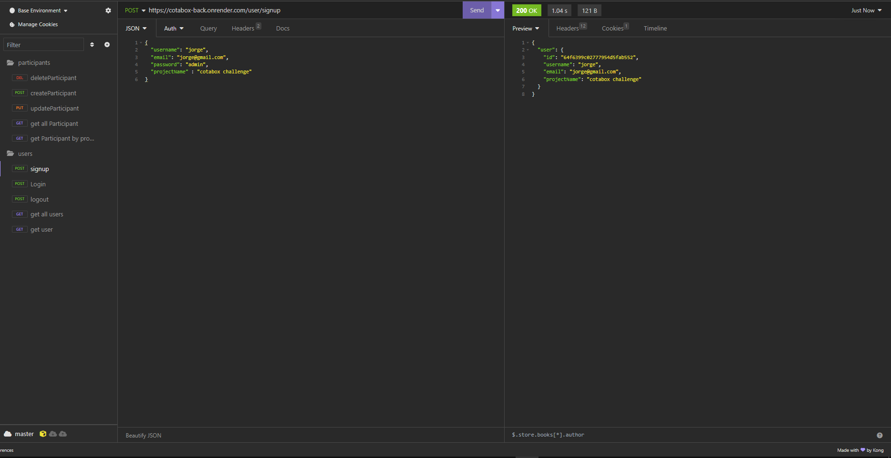

# cotabox-challenge

Desafio técnico para a vaga de Desenvolvedor Full Stack @ Cotabox

## Sumário

- [Autor](#autor)
- [Overview](#overview)
  - [Screenshots](#screenshots)
- [Features](#features)
- [Tecnologias Utilizadas](#tecnologias-utilizadas)
- [Instalação](#instalacao)
- [Uso](#compile-and-minify-for-production)

#### Autor
- Jorge Luiz Lins da Silva

## Overview

### Screenshots

- Home page ('/')

- Register Page ('/register')

- Project Page ('/project')

- Tela do insomnia com as requests criadas

### Features
- Autenticação de usuário: Os usuários podem se registrar e fazer login para acessar o seu projeto.
- Registro de Participação: Usuários autenticados podem registrar participantes informando nome, sobrenome e a participação daquele usuario.
- Visualização de Dados: O aplicativo exibe uma tabela mostrando os dados e participação do usuario, ao lado mostra um gráfico de rosca para fornecer aos usuários uma representação visual de suas participações.

### Tecnologias Utilizadas
- Front-end
    - Vue 3
    - TailwindCSS
    - Axios
    - ChartJS
- Back-end
    - Node
    - Express
    - Prisma(ORM)
    - MongoDB
    - JWT
- Deployment
    - O backend da aplicação teve seu deploy na Render e pode ser acessado por esse dominio: https://cotabox-back.onrender.com
    - O frontend da aplicação foi upado na vercel e pode ser acessado por esse dominio: https://cotabox-front-gray.vercel.app/

### Instalação/Inicialização
- Clone o repositório em sua máquina local.
- Frontend
    - npm install
    - npm run serve
- Backend(caso queira rodar localmente)
    - npm install
    - npm start

### Testes

### Uso
- Registre-se ou faça login no aplicativo.
- Cadastre as pessoas que participaram do seu projeto.
- Visualize suas participações registradas na tabela e no gráfico de rosca.
